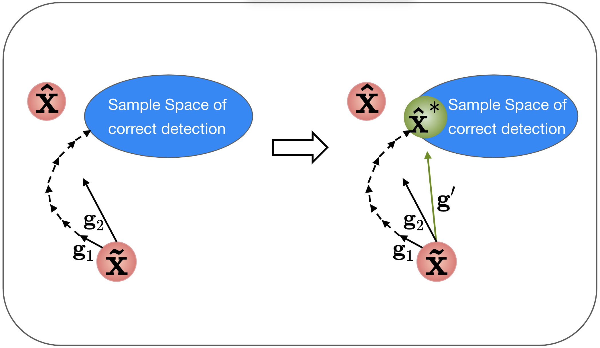
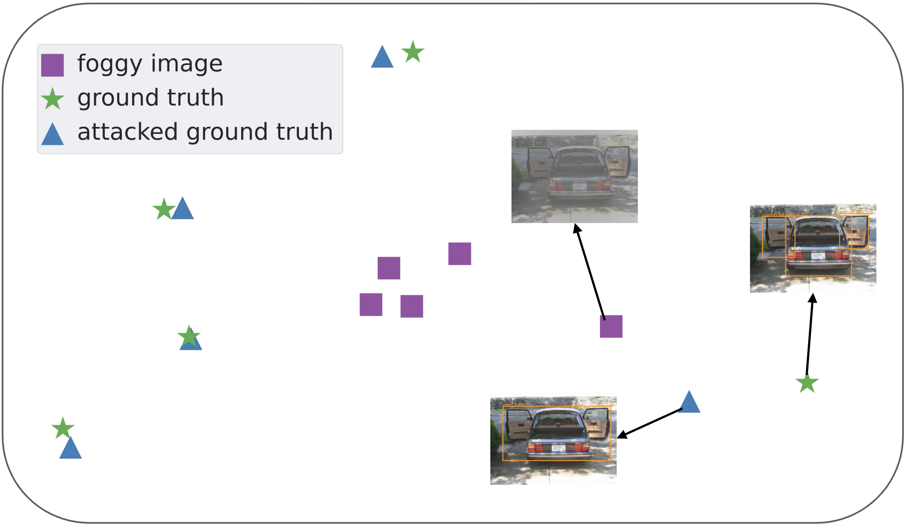

# ReForDe
## Abstract
Although image restoration has achieved significant progress, its potential to assist object detectors in adverse imaging conditions lacks enough attention in the research community. It is reported that the existing image restoration methods cannot improve the object detector performance and sometimes even reduce the detection performance. To address the issue, we propose a targeted adversarial attack in the restoration procedure to boost object detection performance after restoration. Specifically, we present an ADAM-like adversarial attack to generate pseudo ground truth for restoration fine-tuning. Resultant restored images are close to original sharp images, and at the same time, lead to better object detection results. We conduct extensive experiments in image dehazing and low light enhancement and show the superiority of our method over conventional training and other domain adaptation and multi-task methods. The proposed pipeline can be applied to all restoration methods and both one- and two-stage detectors.

Solarized dark             |  Solarized Ocean
:-------------------------:|:-------------------------:
  |  


# Training

```
python train.py --gpu_ids 0 --model_det yolov3 --model_res GridDehaze --lr 1e-7 --tmppath tmp2 --resume ./log/GridDehaze_yolov3_ft/weight/net_1.pkl
```

# Testing

```
python test.py --lq_path [LOW_QUALITY_PATH] --gt_path [GROUND_TRUTH_PATH] --save_path [OUTPUT_PATH] --checkpoint [CHECKPOINT_PATH] --model_res [RESTORATION_MODEL_TYPE (e.g. MSBDN)] --task [dehaze or dark] --model_det [DETECTION_MODEL_YTPE (e.g. yolov3)]
```

# mAP computation

We refer to https://github.com/Cartucho/mAP.git for mAP computation

# Thanks to the following repositories:

yolov3 from https://github.com/qqwweee/keras-yolo3
frcnn from https://github.com/chenyuntc/simple-faster-rcnn-pytorch